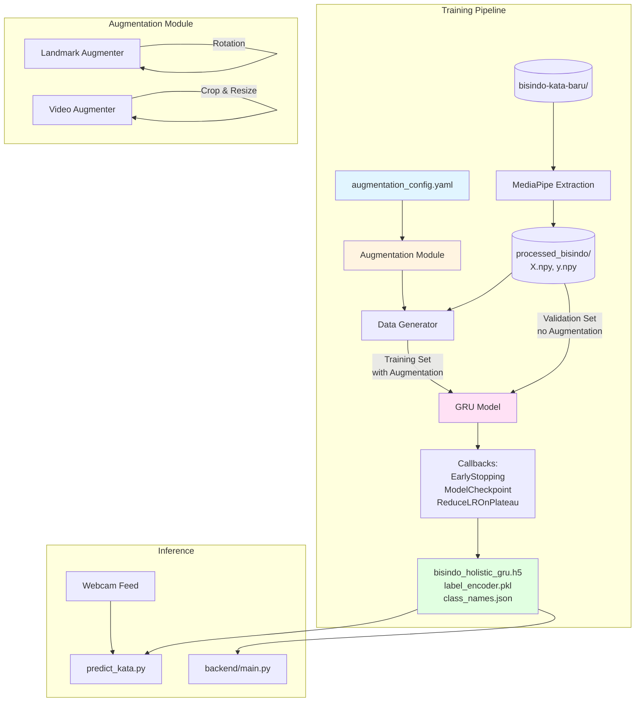

# Design Document: Kata Model Augmentation Improvement

## Overview

This feature enhances the BISINDO kata (word) recognition model by implementing a comprehensive video data augmentation pipeline. The current GRU-based model (`bisindo_holistic_gru.h5`) achieves 85%+ validation accuracy but drops to ~50% during real-time webcam prediction due to insufficient training data variability.

### Problem Statement

The existing training pipeline lacks robustness to:
- User hand dominance variations (left vs right hand)
- Lighting conditions (brightness, contrast)
- Camera positioning (scale, rotation, crop variations)
- Gesture speed variations (fast vs slow signers)
- Sensor noise from low-quality webcams

### Solution Approach

Implement on-the-fly data augmentation at two levels:
1. **Landmark-level augmentation**: Transform MediaPipe Holistic landmark sequences directly (fast, GPU-friendly)
2. **Video-level augmentation** (optional): Transform raw video frames before MediaPipe extraction (more realistic but slower)

The augmentation pipeline will:
- Apply transformations dynamically during training (no disk storage)
- Preserve the existing GRU architecture for fair comparison
- Maintain backward compatibility with `predict_kata.py` and backend API
- Run efficiently on NVIDIA GPU with TensorFlow/CUDA
- Target 75%+ real-time prediction accuracy (up from ~50%)

### Design Goals

1. **Modularity**: Standalone augmentation module reusable across experiments
2. **Configurability**: YAML-based configuration for all augmentation parameters
3. **Performance**: Complete 50-epoch training in ≤2 hours on NVIDIA GPU
4. **Compatibility**: Output model files work with existing inference code unchanged
5. **Reproducibility**: Seed control and config versioning for experiment tracking


## Architecture

### System Architecture Diagram



### Architecture Layers

#### 1. Data Layer
- **Input**: Raw videos from `bisindo-kata-baru/` (50 classes, ~50 videos per class)
- **Preprocessing**: MediaPipe Holistic extraction → landmark sequences `(50, 258)`
- **Caching**: Preprocessed landmarks stored in `processed_bisindo/X.npy` and `y.npy`
- **Split**: 80% train / 20% validation (stratified, random_state=42)


#### 2. Augmentation Layer
- **Mode**: Landmark-level (default) or video-level (optional)
- **Execution**: On-the-fly during training (no disk writes)
- **Techniques**: 7 augmentation types (flip, speed, brightness, contrast, crop, noise, rotation)
- **Configuration**: YAML file with enable/disable flags and parameters per technique
- **Multiplier**: Effective training set size = `original_size × augmentation_multiplier`

#### 3. Model Layer
- **Architecture**: Preserved from baseline (GRU 128 → GRU 64 → Dense 64 → Dense softmax)
- **Input Shape**: `(None, 50, 258)` - 50 frames × 258 features
- **Output**: Softmax over 50 classes
- **Training**: Adam optimizer (lr=0.001), sparse categorical cross-entropy

#### 4. Evaluation Layer
- **Validation**: Unaugmented validation set for fair evaluation
- **Metrics**: Accuracy, loss, per-class precision/recall/F1
- **Artifacts**: Confusion matrix, training curves, per-class reports
- **Comparison**: Optional baseline comparison mode

### Data Flow

1. **Training Initialization**
   - Load `augmentation_config.yaml`
   - Load cached landmarks `X.npy`, `y.npy`
   - Perform train/validation split
   - Initialize DataGenerator with augmentation module

2. **Training Loop** (per epoch)
   - DataGenerator yields batches from training set
   - For each sample: randomly apply augmentations based on config probabilities
   - Model trains on augmented batches
   - Validation runs on unaugmented validation set
   - Callbacks track best model and adjust learning rate

3. **Output Generation**
   - Save best model as `bisindo_holistic_gru.h5`
   - Save label encoder and class names
   - Generate confusion matrix, per-class report, training curves
   - Optionally compare with baseline model


## Components and Interfaces

### 1. Augmentation Module (`Train/augmentation.py`)

#### 1.1 Landmark Augmenter

```python
class LandmarkAugmenter:
    """Applies augmentations to MediaPipe Holistic landmark sequences."""
    
    def __init__(self, config: Dict):
        """
        Args:
            config: Dictionary with augmentation parameters from YAML
        """
        self.config = config
        
    def horizontal_flip(self, sequence: np.ndarray) -> np.ndarray:
        """
        Flips landmarks horizontally and swaps left/right hands.
        
        Args:
            sequence: Shape (50, 258)
        Returns:
            Flipped sequence with shape (50, 258)
        """
        pass
    
    def speed_variation(self, sequence: np.ndarray, factor: float) -> np.ndarray:
        """
        Resamples sequence temporally to simulate speed changes.
        
        Args:
            sequence: Shape (N, 258) where N may vary
            factor: Speed multiplier (0.8-1.2). <1 = slower, >1 = faster
        Returns:
            Resampled sequence with shape (50, 258)
        """
        pass
    
    def random_crop_resize(self, sequence: np.ndarray, scale: float) -> np.ndarray:
        """
        Scales and translates landmark coordinates.
        
        Args:
            sequence: Shape (50, 258)
            scale: Scale factor (0.85-1.15)
        Returns:
            Scaled sequence clipped to [0, 1] with shape (50, 258)
        """
        pass
    
    def gaussian_noise(self, sequence: np.ndarray, std: float) -> np.ndarray:
        """
        Adds Gaussian noise to landmark coordinates.
        
        Args:
            sequence: Shape (50, 258)
            std: Noise standard deviation (relative to [0,1] normalized coords)
        Returns:
            Noisy sequence with shape (50, 258)
        """
        pass
    
    def rotation(self, sequence: np.ndarray, angle_deg: float) -> np.ndarray:
        """
        Rotates landmarks around center point (0.5, 0.5).
        
        Args:
            sequence: Shape (50, 258)
            angle_deg: Rotation angle in degrees (-10 to +10)
        Returns:
            Rotated sequence clipped to [0, 1] with shape (50, 258)
        """
        pass
    
    def augment(self, sequence: np.ndarray) -> np.ndarray:
        """
        Applies all enabled augmentations based on config probabilities.
        
        Args:
            sequence: Shape (50, 258)
        Returns:
            Augmented sequence with shape (50, 258)
        """
        pass
```


#### 1.2 Video Augmenter

```python
class VideoAugmenter:
    """Applies augmentations to raw video frames before MediaPipe extraction."""
    
    def __init__(self, config: Dict):
        """
        Args:
            config: Dictionary with augmentation parameters from YAML
        """
        self.config = config
    
    def horizontal_flip(self, frames: List[np.ndarray]) -> List[np.ndarray]:
        """
        Flips all frames horizontally.
        
        Args:
            frames: List of BGR frames (H, W, 3) uint8
        Returns:
            List of flipped frames
        """
        pass
    
    def brightness_contrast(self, frames: List[np.ndarray], 
                          brightness: float, contrast: float) -> List[np.ndarray]:
        """
        Adjusts brightness and contrast.
        
        Args:
            frames: List of BGR frames (H, W, 3) uint8
            brightness: Brightness offset (-0.2 to +0.2)
            contrast: Contrast multiplier (0.8 to 1.2)
        Returns:
            List of adjusted frames clipped to [0, 255]
        """
        pass
    
    def random_crop_resize(self, frames: List[np.ndarray], 
                          scale: float) -> List[np.ndarray]:
        """
        Crops and resizes frames.
        
        Args:
            frames: List of BGR frames (H, W, 3) uint8
            scale: Scale factor (0.85-1.15)
        Returns:
            List of cropped and resized frames
        """
        pass
    
    def gaussian_noise(self, frames: List[np.ndarray], std: float) -> List[np.ndarray]:
        """
        Adds pixel-level Gaussian noise.
        
        Args:
            frames: List of BGR frames (H, W, 3) uint8
            std: Noise standard deviation (pixel scale 0-255)
        Returns:
            List of noisy frames clipped to [0, 255]
        """
        pass
    
    def rotation(self, frames: List[np.ndarray], angle_deg: float) -> List[np.ndarray]:
        """
        Rotates frames around center.
        
        Args:
            frames: List of BGR frames (H, W, 3) uint8
            angle_deg: Rotation angle in degrees (-10 to +10)
        Returns:
            List of rotated frames
        """
        pass
    
    def augment(self, frames: List[np.ndarray]) -> List[np.ndarray]:
        """
        Applies all enabled augmentations based on config probabilities.
        
        Args:
            frames: List of BGR frames (H, W, 3) uint8
        Returns:
            List of augmented frames
        """
        pass
```


### 2. Data Generator (`Train/data_generator.py`)

```python
class AugmentedSequenceGenerator(tf.keras.utils.Sequence):
    """Keras Sequence generator with on-the-fly augmentation."""
    
    def __init__(self, X: np.ndarray, y: np.ndarray, 
                 augmenter: LandmarkAugmenter,
                 batch_size: int = 32,
                 augmentation_multiplier: int = 3,
                 shuffle: bool = True,
                 is_validation: bool = False):
        """
        Args:
            X: Landmark sequences (N, 50, 258)
            y: Labels (N,)
            augmenter: LandmarkAugmenter instance
            batch_size: Batch size
            augmentation_multiplier: How many times to augment each sample per epoch
            shuffle: Shuffle samples each epoch
            is_validation: If True, disable all augmentations
        """
        self.X = X
        self.y = y
        self.augmenter = augmenter
        self.batch_size = batch_size
        self.augmentation_multiplier = 1 if is_validation else augmentation_multiplier
        self.shuffle = shuffle
        self.is_validation = is_validation
        self.indexes = None
        self.on_epoch_end()
    
    def __len__(self) -> int:
        """Returns number of batches per epoch."""
        return int(np.ceil(len(self.X) * self.augmentation_multiplier / self.batch_size))
    
    def __getitem__(self, index: int) -> Tuple[np.ndarray, np.ndarray]:
        """
        Generate one batch of data.
        
        Args:
            index: Batch index
        Returns:
            Tuple of (X_batch, y_batch)
        """
        pass
    
    def on_epoch_end(self):
        """Shuffle indexes after each epoch."""
        pass
```

### 3. Training Pipeline (`Train/train_kata_bisindo_gru_augmented.py`)

```python
def main():
    # 1. Load and validate config
    config = load_augmentation_config()
    validate_config(config)
    
    # 2. Set random seeds for reproducibility
    set_random_seeds(config['random_seed'])
    
    # 3. Detect and configure GPU
    gpus = setup_gpu()
    log_gpu_info(gpus)
    
    # 4. Load cached landmarks
    X, y = load_landmark_cache()
    log_dataset_info(X, y)
    
    # 5. Encode labels
    le = LabelEncoder()
    y_encoded = le.fit_transform(y)
    save_label_encoder(le)
    
    # 6. Train/validation split
    X_train, X_val, y_train, y_val = train_test_split(
        X, y_encoded, test_size=0.2, random_state=42, stratify=y_encoded
    )
    
    # 7. Initialize augmentation
    augmenter = LandmarkAugmenter(config)
    
    # 8. Create data generators
    train_gen = AugmentedSequenceGenerator(
        X_train, y_train, augmenter,
        batch_size=config['batch_size'],
        augmentation_multiplier=config['augmentation_multiplier'],
        shuffle=True, is_validation=False
    )
    val_gen = AugmentedSequenceGenerator(
        X_val, y_val, augmenter,
        batch_size=config['batch_size'],
        shuffle=False, is_validation=True
    )
    
    # 9. Build model
    model = build_gru_model(sequence_length=50, num_features=258, num_classes=len(le.classes_))
    
    # 10. Train with callbacks
    callbacks = create_callbacks(config)
    history = model.fit(
        train_gen, validation_data=val_gen,
        epochs=config['epochs'], callbacks=callbacks
    )
    
    # 11. Evaluate and generate reports
    evaluate_model(model, X_val, y_val, le)
    generate_confusion_matrix(model, X_val, y_val, le)
    generate_training_plots(history)
    generate_per_class_report(model, X_val, y_val, le)
    
    # 12. Optional baseline comparison
    if config.get('compare_baseline'):
        compare_with_baseline(model, config['baseline_model_path'], X_val, y_val, le)
```


## Data Models

### 1. Landmark Sequence Format

```python
# Shape: (SEQUENCE_LENGTH, NUM_FEATURES) = (50, 258)
# Layout:
#   - Pose landmarks: [0:132]   (33 landmarks × 4 features: x, y, z, visibility)
#   - Left hand:      [132:195] (21 landmarks × 3 features: x, y, z)
#   - Right hand:     [195:258] (21 landmarks × 3 features: x, y, z)
#
# Coordinate system:
#   - x, y: normalized to [0, 1] (MediaPipe convention)
#   - z: depth relative to hip center
#   - visibility: [0, 1] confidence score (pose only)
```

### 2. Augmentation Configuration Schema

```yaml
# Train/augmentation_config.yaml

# Global settings
random_seed: 42
batch_size: 32
epochs: 50
augmentation_multiplier: 3  # Effective training set = original × 3
augmentation_mode: "landmark"  # "landmark" or "video_prepass"

# Horizontal flip
enable_horizontal_flip: true
flip_probability: 0.5

# Speed variation
enable_speed_variation: true
speed_factors: [0.8, 0.9, 1.0, 1.1, 1.2]
speed_probability: 0.7

# Brightness and contrast (video mode only)
enable_brightness_contrast: false  # Only for video_prepass mode
brightness_range: [-0.2, 0.2]
contrast_range: [0.8, 1.2]

# Random crop and resize
enable_random_crop_resize: true
scale_range: [0.85, 1.15]
crop_probability: 0.5

# Gaussian noise
enable_gaussian_noise: true
landmark_noise_std: 0.005  # Relative to [0,1] coordinate space
pixel_noise_std: 5.0       # Pixel-level noise for video mode
noise_probability: 0.5

# Rotation
enable_rotation: true
rotation_range_degrees: [-10.0, 10.0]
rotation_probability: 0.5

# Baseline comparison (optional)
compare_baseline: false
baseline_model_path: ""
```

### 3. Training History Format

```json
{
  "timestamp": "2024-01-15T10:30:00",
  "config_hash": "a3f2e9d1",
  "dataset_info": {
    "total_samples": 2500,
    "train_samples": 2000,
    "val_samples": 500,
    "num_classes": 50
  },
  "training_duration_seconds": 5430,
  "best_epoch": 38,
  "best_val_accuracy": 0.892,
  "history": {
    "epoch": [1, 2, 3, "..."],
    "loss": [2.15, 1.87, 1.62, "..."],
    "accuracy": [0.42, 0.53, 0.61, "..."],
    "val_loss": [1.92, 1.75, 1.58, "..."],
    "val_accuracy": [0.48, 0.56, 0.64, "..."],
    "lr": [0.001, 0.001, 0.001, "..."]
  }
}
```


### 4. Model Output Files

#### bisindo_holistic_gru.h5
- **Format**: Keras HDF5 model file
- **Input shape**: `(None, 50, 258)`
- **Output shape**: `(None, 50)` - softmax probabilities over 50 classes
- **Compatibility**: Must load with `tf.keras.models.load_model()` without custom objects
- **Size**: ~2-5 MB

#### label_encoder.pkl
- **Format**: Pickled sklearn LabelEncoder
- **Classes**: 50 BISINDO kata class names (e.g., "Apa", "Siapa", "Berdiri", ...)
- **Interface**: `le.transform(['Apa'])` → `[0]`, `le.inverse_transform([0])` → `['Apa']`

#### class_names.json
- **Format**: JSON array of strings
- **Content**: `["Apa", "Bagaimana", "Berdiri", ...]` (alphabetically sorted)
- **Purpose**: Human-readable class list for documentation

## Error Handling

### 1. Configuration Validation Errors

**Error**: Invalid augmentation config parameter
```python
# Example: rotation_range_degrees not a tuple
ConfigValidationError: 'rotation_range_degrees' must be a tuple of two floats, got <class 'int'>

# Recovery: Use default value and warn user
WARNING: Using default rotation_range_degrees=(-10.0, 10.0)
```

**Error**: Missing config file
```python
FileNotFoundError: augmentation_config.yaml not found at Train/augmentation_config.yaml

# Recovery: Use hardcoded defaults
WARNING: Config file not found. Using default augmentation parameters.
```

### 2. GPU Detection Errors

**Error**: No GPU detected
```python
WARNING: No NVIDIA GPU detected. Training will run on CPU and may take >4 hours.
Detected devices: [PhysicalDevice(name='/physical_device:CPU:0', device_type='CPU')]

# Prompt user for confirmation
Continue training on CPU? [y/N]:
```

**Error**: GPU out of memory
```python
ResourceExhaustedError: OOM when allocating tensor with shape [32,50,258]

# Recovery: Reduce batch size automatically
WARNING: GPU OOM detected. Reducing batch_size from 32 to 16 and retrying.
```


### 3. Data Loading Errors

**Error**: Cached landmarks not found
```python
FileNotFoundError: processed_bisindo/X.npy or y.npy not found

# Recovery: Run preprocessing automatically
INFO: Cached landmarks not found. Running MediaPipe extraction on bisindo-kata-baru/...
[==================== ] 1250/2500 videos processed (50%)
```

**Error**: Class count mismatch
```python
ValueError: Expected 50 classes but found 48 classes in dataset.
Missing classes: ['Dimana', 'Kapan']

# Recovery: Halt execution (training with wrong classes is worse than no training)
ERROR: Cannot proceed with incorrect number of classes. Please check dataset integrity.
```

### 4. Augmentation Runtime Errors

**Error**: Augmentation produces invalid landmarks
```python
# Example: All landmarks become NaN after rotation
RuntimeWarning: Augmentation produced NaN values. Using original sample.
  Sample index: 1523
  Augmentation: rotation (angle=8.7 degrees)

# Recovery: Log warning, use original unaugmented sample, continue training
```

**Error**: Speed variation produces empty sequence
```python
# Example: Extreme speed factor causes zero-length sequence
RuntimeWarning: Speed variation produced empty sequence. Using original sample.
  Sample index: 892
  Speed factor: 0.75

# Recovery: Log warning, use original sample, continue training
```

### 5. Model Training Errors

**Error**: Early stopping triggered too early
```python
INFO: Early stopping triggered at epoch 12. Best validation accuracy: 0.68

# This is informational, not an error. Model may underfit if stopped too early.
# Recovery: User can adjust patience in config or disable early stopping
```

**Error**: Model divergence (loss becomes NaN)
```python
RuntimeError: Training loss became NaN at epoch 8.
  Possible causes: learning rate too high, numerical instability

# Recovery: Halt training, suggest lower learning rate
ERROR: Training failed due to numerical instability. Try reducing learning_rate to 0.0005.
```

### 6. File I/O Errors

**Error**: Cannot write output files (permission denied)
```python
PermissionError: Cannot write to bisindo_holistic_gru.h5 (file may be in use)

# Recovery: Try alternative filename with timestamp
WARNING: Cannot overwrite existing model. Saving as bisindo_holistic_gru_20240115_103045.h5
```

**Error**: Disk full during report generation
```python
OSError: [Errno 28] No space left on device: 'reports/confusion_matrix_20240115_103045.png'

# Recovery: Skip non-essential reports, save model first
WARNING: Cannot save confusion matrix due to disk space. Model saved successfully.
```


## Testing Strategy

### Overview

This feature is a **machine learning training pipeline** focused on data augmentation for video-based gesture recognition. Property-based testing is **not appropriate** for this type of system because:

1. **Non-deterministic outputs**: ML training involves stochastic optimization (random weight initialization, random augmentation, shuffled batches)
2. **External dependencies**: MediaPipe, TensorFlow/GPU drivers, file I/O
3. **No universal invariants**: Model accuracy varies with hyperparameters, data quality, and training dynamics
4. **High computational cost**: Each "test iteration" would require training a full neural network

Instead, we use a **dual testing approach**:
- **Unit tests** for individual augmentation functions with deterministic inputs
- **Integration tests** for the full pipeline with fixed seeds and small datasets
- **Manual validation** for model performance metrics (accuracy, confusion matrix)

### Unit Testing Strategy

#### 1. Augmentation Functions

**Test horizontal flip transformation**
```python
def test_horizontal_flip_swaps_hands():
    # Given: A landmark sequence with distinct left/right hand positions
    sequence = create_test_sequence(left_hand_x=0.2, right_hand_x=0.8)
    augmenter = LandmarkAugmenter(default_config())
    
    # When: Apply horizontal flip
    flipped = augmenter.horizontal_flip(sequence)
    
    # Then: Left and right hands are swapped
    assert flipped[0, 132] == pytest.approx(0.8, abs=0.01)  # Left hand now at 0.8
    assert flipped[0, 195] == pytest.approx(0.2, abs=0.01)  # Right hand now at 0.2
```

**Test speed variation maintains sequence length**
```python
def test_speed_variation_maintains_length():
    # Given: A 30-frame sequence
    sequence = np.random.rand(30, 258).astype(np.float32)
    augmenter = LandmarkAugmenter(default_config())
    
    # When: Apply speed variation with any factor
    for factor in [0.8, 1.0, 1.2]:
        varied = augmenter.speed_variation(sequence, factor)
        
        # Then: Output is always 50 frames
        assert varied.shape == (50, 258)
```

**Test rotation angle bounds**
```python
def test_rotation_respects_angle_range():
    # Given: Config with rotation range [-10, 10] degrees
    config = {'rotation_range_degrees': (-10.0, 10.0)}
    augmenter = LandmarkAugmenter(config)
    sequence = np.random.rand(50, 258).astype(np.float32)
    
    # When: Apply rotation 100 times
    angles_used = []
    for _ in range(100):
        _ = augmenter.rotation(sequence, angle_deg=None)  # Random angle
        # (capture actual angle used via augmenter's internal state)
    
    # Then: All angles are within configured range
    assert all(-10 <= angle <= 10 for angle in angles_used)
```


**Test Gaussian noise does not affect visibility field**
```python
def test_gaussian_noise_preserves_visibility():
    # Given: A sequence with known visibility values
    sequence = np.zeros((50, 258), dtype=np.float32)
    sequence[:, 3] = 0.95  # Set visibility for first pose landmark
    augmenter = LandmarkAugmenter({'landmark_noise_std': 0.01})
    
    # When: Apply Gaussian noise
    noisy = augmenter.gaussian_noise(sequence, std=0.01)
    
    # Then: Visibility field is unchanged
    assert np.allclose(noisy[:, 3], 0.95, atol=1e-6)
```

**Test crop and resize clipping**
```python
def test_crop_resize_clips_to_valid_range():
    # Given: A sequence with landmarks at edges
    sequence = np.zeros((50, 258), dtype=np.float32)
    sequence[:, 0] = 0.05  # x coordinate near left edge
    augmenter = LandmarkAugmenter({'scale_range': (0.85, 1.15)})
    
    # When: Apply crop with large scale (may push coordinates out of bounds)
    scaled = augmenter.random_crop_resize(sequence, scale=1.15)
    
    # Then: All x, y coordinates are in [0, 1]
    x_coords = scaled[:, 0::3]  # Every 3rd element starting from 0
    y_coords = scaled[:, 1::3]
    assert np.all((x_coords >= 0) & (x_coords <= 1))
    assert np.all((y_coords >= 0) & (y_coords <= 1))
```

#### 2. Configuration Validation

**Test config validation rejects invalid types**
```python
def test_config_validation_rejects_invalid_type():
    # Given: Config with wrong type for rotation_range_degrees
    config = {'rotation_range_degrees': 10}  # Should be tuple
    
    # When/Then: Validation raises error
    with pytest.raises(ConfigValidationError, match="must be a tuple"):
        validate_config(config)
```

**Test config validation accepts valid config**
```python
def test_config_validation_accepts_valid_config():
    # Given: A valid config
    config = load_default_config()
    
    # When: Validate config
    validate_config(config)
    
    # Then: No exception raised (implicit assertion)
```

#### 3. Data Generator

**Test data generator batch shape**
```python
def test_data_generator_batch_shape():
    # Given: A generator with 100 samples, batch_size=32
    X = np.random.rand(100, 50, 258).astype(np.float32)
    y = np.random.randint(0, 50, size=100)
    augmenter = LandmarkAugmenter(default_config())
    gen = AugmentedSequenceGenerator(X, y, augmenter, batch_size=32)
    
    # When: Get first batch
    X_batch, y_batch = gen[0]
    
    # Then: Batch has correct shape
    assert X_batch.shape == (32, 50, 258)
    assert y_batch.shape == (32,)
```

**Test validation generator disables augmentation**
```python
def test_validation_generator_disables_augmentation():
    # Given: A validation generator
    X = np.random.rand(50, 50, 258).astype(np.float32)
    y = np.random.randint(0, 50, size=50)
    augmenter = LandmarkAugmenter(default_config())
    gen = AugmentedSequenceGenerator(X, y, augmenter, is_validation=True)
    
    # When: Get a batch
    X_batch, _ = gen[0]
    
    # Then: Batch is identical to original (no augmentation)
    # (This requires augmenter to track whether augmentation was applied)
    assert augmenter.call_count == 0
```


### Integration Testing Strategy

#### 1. End-to-End Training Pipeline (Small Dataset)

**Test training completes successfully**
```python
@pytest.mark.slow
def test_training_pipeline_completes():
    # Given: A small dataset (5 classes × 10 videos = 50 samples)
    X = np.random.rand(50, 50, 258).astype(np.float32)
    y = np.repeat(np.arange(5), 10)  # Balanced classes
    
    # When: Run training with 5 epochs, seed=42
    config = {
        'random_seed': 42,
        'epochs': 5,
        'batch_size': 8,
        'augmentation_multiplier': 2
    }
    model, history = train_model(X, y, config)
    
    # Then: Training completes without errors
    assert model is not None
    assert len(history.history['loss']) == 5
    
    # Then: Model can make predictions
    preds = model.predict(X[:5])
    assert preds.shape == (5, 5)  # 5 samples × 5 classes
```

**Test output files are created**
```python
@pytest.mark.slow
def test_output_files_created():
    # Given: A trained model (from previous test)
    # When: Training completes
    # (Run training in this test or reuse from previous)
    
    # Then: All output files exist
    assert os.path.exists('bisindo_holistic_gru.h5')
    assert os.path.exists('label_encoder.pkl')
    assert os.path.exists('class_names.json')
    
    # Then: Model can be loaded
    model = tf.keras.models.load_model('bisindo_holistic_gru.h5', compile=False)
    assert model.input_shape == (None, 50, 258)
```

#### 2. Model Compatibility

**Test model compatibility with predict_kata.py**
```python
def test_model_compatible_with_inference_script():
    # Given: A trained model
    # When: Load model the same way predict_kata.py does
    model = tf.keras.models.load_model('bisindo_holistic_gru.h5', compile=False)
    with open('label_encoder.pkl', 'rb') as f:
        le = pickle.load(f)
    
    # Then: Model and label encoder work together
    X_test = np.random.rand(1, 50, 258).astype(np.float32)
    preds = model.predict(X_test, verbose=0)[0]
    pred_idx = int(np.argmax(preds))
    pred_label = le.inverse_transform([pred_idx])[0]
    
    assert isinstance(pred_label, str)
    assert pred_label in le.classes_
```

#### 3. GPU Utilization (Manual Validation)

**Test GPU is utilized during training**
```python
@pytest.mark.gpu
def test_gpu_utilization():
    # Given: A system with NVIDIA GPU
    gpus = tf.config.list_physical_devices('GPU')
    assert len(gpus) > 0, "No GPU detected. This test requires NVIDIA GPU."
    
    # When: Run training
    # (Monitor GPU utilization via nvidia-smi or TensorFlow profiler)
    
    # Then: GPU memory is allocated and utilization is >0%
    # (This is a manual check - automated GPU monitoring is complex)
    print("Manual check: Run 'nvidia-smi' during training to verify GPU utilization")
```


### Manual Validation Strategy

#### 1. Model Performance Metrics

**Acceptance criteria from requirements**:
- Real-time prediction accuracy increases from ~50% to ≥75%
- Training completes in ≤2 hours on NVIDIA GPU

**Validation procedure**:
1. Train baseline model (no augmentation) on full dataset
2. Record baseline validation accuracy and real-time webcam accuracy
3. Train augmented model with default config
4. Record augmented validation accuracy
5. Deploy augmented model to `predict_kata.py`
6. Test real-time accuracy with 20 different signs × 5 repetitions = 100 predictions
7. Calculate accuracy = correct predictions / total predictions
8. Compare baseline vs augmented

**Success criteria**:
- Augmented model real-time accuracy ≥ 75%
- Augmented model real-time accuracy > baseline + 15 percentage points

#### 2. Visual Inspection of Augmentations

**Procedure**:
1. Run `python Train/augmentation.py` (smoke test mode)
2. For each augmentation type:
   - Load a sample video
   - Apply augmentation
   - Display original vs augmented side-by-side
   - Verify transformation looks correct (e.g., flip actually flips, rotation is visible)

**Example checks**:
- Horizontal flip: Left hand becomes right hand
- Speed variation: Gesture appears faster/slower
- Brightness: Image is brighter/darker
- Rotation: Image is tilted
- Noise: Slight graininess visible

#### 3. Confusion Matrix Analysis

**Procedure**:
1. After training, open `reports/confusion_matrix_<timestamp>.png`
2. Identify classes with high confusion (off-diagonal values)
3. Cross-reference with `reports/per_class_report_<timestamp>.csv`
4. Prioritize problematic classes for future data collection

**Example analysis**:
```
Class "Apa" vs "Siapa": Confusion count = 15
→ These signs may be visually similar
→ Consider adding more diverse samples or specific augmentation
```

#### 4. Training Curve Analysis

**Procedure**:
1. Open `reports/training_history_<timestamp>.png`
2. Check for overfitting (train acc >> val acc)
3. Check for underfitting (both accuracies plateau at low values)
4. Verify early stopping triggered appropriately

**Healthy training curves**:
- Training and validation accuracy both increase
- Validation accuracy plateaus or slowly improves after epoch 20-30
- Gap between train and val accuracy is small (<10 percentage points)


### Test Coverage Summary

| Component | Test Type | Coverage |
|-----------|-----------|----------|
| Horizontal flip | Unit | ✓ Coordinate transformation, hand swapping |
| Speed variation | Unit | ✓ Resampling logic, length preservation |
| Crop & resize | Unit | ✓ Scaling, clipping, boundary conditions |
| Gaussian noise | Unit | ✓ Noise application, visibility preservation |
| Rotation | Unit | ✓ Rotation matrix, angle bounds, clipping |
| Config validation | Unit | ✓ Type checking, range validation, defaults |
| Data generator | Unit | ✓ Batch shape, augmentation toggle, shuffling |
| Full training pipeline | Integration | ✓ End-to-end (small dataset) |
| Model compatibility | Integration | ✓ Load model, predict, label decoding |
| GPU utilization | Integration | ✓ GPU detection, memory growth |
| Real-time accuracy | Manual | Performance target: ≥75% |
| Training duration | Manual | Performance target: ≤2 hours |
| Visual augmentation quality | Manual | Smoke test inspection |
| Confusion matrix | Manual | Per-class error analysis |
| Training curves | Manual | Overfitting/underfitting detection |

### Test Execution

**Unit tests**: Run with `pytest tests/test_augmentation.py -v`
**Integration tests**: Run with `pytest tests/test_integration.py -v --slow`
**GPU tests**: Run with `pytest tests/test_integration.py -v --gpu` (requires NVIDIA GPU)
**Manual validation**: Follow procedures in section 3 after full training run

### Continuous Validation

**During development**:
- Run unit tests on every code change
- Run integration tests before committing
- Run smoke test (`python Train/augmentation.py`) to verify augmentations visually

**Before deployment**:
- Train model on full dataset with seed=42
- Verify training completes in ≤2 hours
- Test real-time accuracy with 100 predictions
- Compare with baseline model
- Review confusion matrix for problematic classes

**After deployment**:
- Monitor real-time prediction accuracy in production
- Collect failed prediction examples for future training
- Periodically retrain with updated dataset


## Implementation Notes

### 1. Landmark Coordinate System

MediaPipe Holistic outputs normalized coordinates:
- **x, y**: [0, 1] range where (0, 0) is top-left, (1, 1) is bottom-right
- **z**: Depth relative to hip, approximately [-1, 1] range
- **visibility**: [0, 1] confidence score (pose landmarks only)

**Critical for augmentation**:
- Horizontal flip: `x_new = 1.0 - x_old`
- Crop/resize: Must maintain [0, 1] bounds after transformation
- Rotation: 2D rotation around center (0.5, 0.5) in x-y plane only

### 2. Hand Landmark Swapping for Horizontal Flip

When flipping horizontally, left and right hands must be swapped:

```python
# Feature vector layout:
# [0:132]   - Pose (33 landmarks × 4 features)
# [132:195] - Left hand (21 landmarks × 3 features)
# [195:258] - Right hand (21 landmarks × 3 features)

flipped = sequence.copy()
flipped[:, :132] = flip_x_coordinates(sequence[:, :132])  # Flip pose
flipped[:, 132:195] = flip_x_coordinates(sequence[:, 195:258])  # Right → Left
flipped[:, 195:258] = flip_x_coordinates(sequence[:, 132:195])  # Left → Right
```

### 3. Speed Variation Resampling

Speed variation changes temporal sampling rate while preserving SEQUENCE_LENGTH:

```python
# Example: factor=0.8 (slower gesture)
# Original: 50 frames → Resample to 62.5 frames → Downsample to 50 frames
# Effect: Gesture appears to slow down

def speed_variation(sequence, factor):
    target_len = int(len(sequence) / factor)
    # Interpolate to target_len
    resampled = np.array([
        np.interp(
            np.linspace(0, len(sequence)-1, target_len),
            np.arange(len(sequence)),
            sequence[:, i]
        ) for i in range(258)
    ]).T
    # Normalize back to SEQUENCE_LENGTH=50
    return normalize_sequence(resampled, target_length=50)
```

### 4. GPU Memory Management

TensorFlow allocates all GPU memory by default. Use memory growth to avoid OOM:

```python
gpus = tf.config.list_physical_devices('GPU')
if gpus:
    for gpu in gpus:
        tf.config.experimental.set_memory_growth(gpu, True)
```

Also consider:
- Reducing batch size if OOM occurs
- Using mixed precision training (`tf.keras.mixed_precision.set_global_policy('mixed_float16')`)
- Clearing Keras session between runs


### 5. Rotation Matrix for 2D Rotation

Rotate landmarks around center point (0.5, 0.5):

```python
def rotate_landmarks(sequence, angle_deg):
    angle_rad = np.radians(angle_deg)
    cos_a, sin_a = np.cos(angle_rad), np.sin(angle_rad)
    
    # Rotation matrix around (0.5, 0.5)
    def rotate_point(x, y):
        x_centered = x - 0.5
        y_centered = y - 0.5
        x_rotated = x_centered * cos_a - y_centered * sin_a
        y_rotated = x_centered * sin_a + y_centered * cos_a
        return x_rotated + 0.5, y_rotated + 0.5
    
    # Apply to all x, y coordinates (skip z and visibility)
    rotated = sequence.copy()
    for i in range(0, 132, 4):  # Pose: every 4th is x, y, z, visibility
        rotated[:, i], rotated[:, i+1] = rotate_point(sequence[:, i], sequence[:, i+1])
    for i in range(132, 258, 3):  # Hands: every 3rd is x, y, z
        rotated[:, i], rotated[:, i+1] = rotate_point(sequence[:, i], sequence[:, i+1])
    
    return np.clip(rotated, 0, 1)
```

### 6. Augmentation Probability Strategy

Each augmentation has an independent probability per sample:

```python
def augment(self, sequence):
    result = sequence.copy()
    
    if self.config['enable_horizontal_flip']:
        if random.random() < self.config['flip_probability']:
            result = self.horizontal_flip(result)
    
    if self.config['enable_speed_variation']:
        if random.random() < self.config['speed_probability']:
            factor = random.choice(self.config['speed_factors'])
            result = self.speed_variation(result, factor)
    
    # ... similar for other augmentations
    
    return result
```

**Key insight**: Augmentations compose (can apply multiple to same sample). This increases diversity beyond `augmentation_multiplier`.

### 7. Reproducibility with Random Seeds

Set all random seeds at start of training:

```python
def set_random_seeds(seed=42):
    random.seed(seed)
    np.random.seed(seed)
    tf.random.set_seed(seed)
    os.environ['PYTHONHASHSEED'] = str(seed)
```

**Limitations**: GPU operations may still be non-deterministic due to floating-point rounding and parallel execution. For exact reproducibility, use CPU only (not recommended for performance).


### 8. Windows Path Compatibility

Ensure path handling works on Windows:

```python
# Use os.path.join or pathlib.Path
dataset_path = os.path.join("bisindo-kata-baru", "5W+1H", "Apa")
# NOT: dataset_path = "bisindo-kata-baru/5W+1H/Apa"  (Unix-style)

# Use raw strings for Windows paths
config_path = r"Train\augmentation_config.yaml"
# Or use forward slashes (works on Windows too)
config_path = "Train/augmentation_config.yaml"
```

### 9. Class Balance and Stratified Split

Maintain class balance during train/validation split:

```python
X_train, X_val, y_train, y_val = train_test_split(
    X, y_encoded,
    test_size=0.2,
    random_state=42,
    stratify=y_encoded  # Critical: ensures each class has proportional representation
)
```

Augmentation multiplier applies equally to all classes, preserving balance:
```python
# If class "Apa" has 40 training samples, augmentation_multiplier=3 gives 120 samples per epoch
# Same ratio for all classes → balance preserved
```

### 10. Early Stopping Strategy

```python
early_stopping = EarlyStopping(
    monitor='val_loss',     # Monitor validation loss (more stable than val_accuracy)
    patience=15,            # Wait 15 epochs without improvement
    restore_best_weights=True,  # Rollback to best epoch
    verbose=1
)
```

**Rationale**: 
- `patience=15` allows model to escape local minima
- `restore_best_weights` prevents overfitting by restoring to best validation performance
- Monitoring `val_loss` is more sensitive than `val_accuracy` for small improvements

### 11. Learning Rate Schedule

```python
reduce_lr = ReduceLROnPlateau(
    monitor='val_loss',
    factor=0.5,         # Reduce LR by half
    patience=5,         # Wait 5 epochs without improvement
    min_lr=1e-6,        # Don't go below 1e-6
    verbose=1
)
```

**Effect**: Starts at `lr=0.001`, reduces to `0.0005`, then `0.00025`, etc. when validation plateaus. Helps model converge to better local minimum.


## Performance Considerations

### 1. Training Performance Targets

| Metric | Target | Rationale |
|--------|--------|-----------|
| Training time | ≤2 hours (50 epochs) | Developer productivity |
| Inference latency | <100ms per prediction | Real-time webcam experience |
| Model size | <10 MB | Easy deployment to web backend |
| GPU memory | <4 GB | Compatible with consumer GPUs |
| Training throughput | ≥30 samples/second | Fast iteration on augmentation params |

### 2. Bottleneck Analysis

**Current bottlenecks** (from baseline):
1. MediaPipe extraction: ~1-2 seconds per video (offline preprocessing)
2. Model training: ~3-4 hours on CPU (addressed by GPU)
3. Data loading: Sequential numpy loads (can be parallelized)

**Augmentation overhead** (expected):
- Landmark-level: <1ms per sample (numpy operations)
- Video-level: ~50-100ms per sample (MediaPipe re-extraction)
- **Recommendation**: Use landmark-level augmentation for speed

### 3. Optimization Strategies

#### Caching Strategy
```python
# Preprocessing (run once)
extract_videos_to_landmarks()  # Slow: MediaPipe extraction
save_to_npy()                  # Fast: NumPy save

# Training (run many times)
load_from_npy()                # Fast: NumPy load
apply_augmentation()           # Fast: NumPy operations
train_model()                  # GPU-accelerated
```

#### Batch Processing
- Use `batch_size=32` (default) for balanced GPU utilization
- Increase to 64 if GPU has >6GB memory
- Decrease to 16 if OOM occurs

#### Mixed Precision Training
```python
# Enable mixed precision (optional, for RTX 20xx/30xx GPUs)
tf.keras.mixed_precision.set_global_policy('mixed_float16')
# Expected speedup: 1.5-2x, with minimal accuracy impact
```

#### Multi-GPU Training (future)
```python
# For systems with multiple GPUs
strategy = tf.distribute.MirroredStrategy()
with strategy.scope():
    model = build_gru_model(...)
# Expected speedup: ~1.8x per additional GPU
```


### 4. Memory Footprint

**Training memory usage** (estimated):
```
Dataset in RAM:        2000 samples × 50 frames × 258 features × 4 bytes = ~100 MB
Model parameters:      ~500K parameters × 4 bytes = ~2 MB
Optimizer state:       ~3× model size = ~6 MB
GPU batch buffer:      32 samples × 50 × 258 × 4 bytes = ~1.6 MB
Activation memory:     ~100-200 MB (depends on batch size)
---
Total:                 ~300-400 MB (well within consumer GPU limits)
```

**Peak memory**: During confusion matrix generation (50×50 matrix on full validation set), may spike to ~1 GB briefly.

### 5. Disk I/O

**Storage requirements**:
- Raw videos: ~5-10 GB (original dataset)
- Preprocessed landmarks: ~100-200 MB (`X.npy`, `y.npy`)
- Trained model: ~2-5 MB (`bisindo_holistic_gru.h5`)
- Reports and logs: ~10-50 MB per training run
- **Total**: ~6-11 GB

**I/O patterns**:
- **Preprocessing**: Sequential read of videos (one-time, slow)
- **Training**: Single load of `X.npy`/`y.npy` at start (fast, <1 second)
- **Checkpoint**: Periodic write of model (every epoch with improvement, <1 second each)
- **Reports**: Batch write at end (1-2 seconds total)

**Optimization**: Use SSD for workspace to speed up video preprocessing. Training I/O is minimal and won't benefit significantly from SSD.

## Deployment Considerations

### 1. Backward Compatibility

**Requirement**: New model must work with existing inference code without modifications.

**Compatibility checklist**:
- ✓ Model input shape: `(None, 50, 258)` - preserved
- ✓ Model output shape: `(None, 50)` - preserved
- ✓ File names: `bisindo_holistic_gru.h5`, `label_encoder.pkl`, `class_names.json` - preserved
- ✓ Label encoding: Same 50 classes in same order - preserved via stratified split and LabelEncoder
- ✓ Loading interface: `tf.keras.models.load_model()` without custom objects - preserved

### 2. Deployment Steps

1. **Train model** with augmentation on development machine
2. **Validate** real-time accuracy with `predict_kata.py`
3. **Copy files** to production:
   ```
   bisindo_holistic_gru.h5 → backend/Models/
   label_encoder.pkl → backend/Models/
   ```
4. **Restart backend** (if running)
5. **Test** inference endpoint with sample videos
6. **Monitor** accuracy in production logs


### 3. Rollback Plan

If augmented model performs worse in production:

1. **Immediate rollback**: Copy old model files back to `backend/Models/`
2. **Diagnose issue**: Review confusion matrix and per-class report
3. **Adjust augmentation**: Modify `augmentation_config.yaml` and retrain
4. **A/B testing** (optional): Deploy both models and compare metrics

### 4. Monitoring and Maintenance

**Metrics to track**:
- Real-time prediction accuracy (sample 100 predictions per day)
- Per-class accuracy distribution
- Failed prediction examples (save for retraining)
- Inference latency (should remain <100ms)

**Retraining triggers**:
- Accuracy drops below 70% (investigate data drift)
- New classes added to dataset
- Collected >500 new video samples
- User feedback indicates specific problematic signs

## Future Enhancements

### 1. Advanced Augmentation Techniques

**Mixup augmentation**:
- Blend two samples: `x_mixed = alpha * x1 + (1 - alpha) * x2`
- Helps with class boundary smoothing
- Implementation complexity: Medium

**Temporal cutout**:
- Randomly mask segments of the sequence (simulate occlusion)
- Forces model to recognize from partial gestures
- Implementation complexity: Low

**Adversarial augmentation**:
- Generate adversarial perturbations to improve robustness
- Implementation complexity: High

### 2. Adaptive Augmentation

**Auto-augmentation**:
- Learn optimal augmentation policy via reinforcement learning
- Similar to AutoAugment for images, adapted for time series
- Implementation complexity: Very high

**Per-class augmentation**:
- Apply different augmentation strengths to different classes
- Focus on hard-to-recognize classes
- Implementation complexity: Medium

### 3. Model Architecture Improvements

**Bidirectional GRU**:
- Process sequence forward and backward
- May improve temporal context understanding
- Expected accuracy gain: +2-3%

**Attention mechanism**:
- Focus on discriminative frames in sequence
- Reduces impact of irrelevant frames (e.g., transition frames)
- Expected accuracy gain: +3-5%

**Transformer architecture**:
- Replace GRU with Transformer encoder
- Better long-range dependencies
- Expected accuracy gain: +5-8%, but requires more data


### 4. Data Collection Improvements

**Active learning**:
- Identify most uncertain predictions in production
- Request manual labeling for those samples
- Retrain with high-value samples
- Expected data efficiency: 2-3x fewer samples needed

**Multi-user recording**:
- Record same sign from multiple users
- Increases inter-user variability in dataset
- Expected accuracy gain: +5-10%

**Different lighting conditions**:
- Record in bright, dim, and mixed lighting
- Improves brightness/contrast robustness
- Expected accuracy gain: +3-5%

### 5. Evaluation Improvements

**Cross-validation**:
- 5-fold cross-validation instead of single 80/20 split
- More reliable accuracy estimate
- Implementation complexity: Low

**Per-user evaluation**:
- Split dataset by user (not random)
- Evaluate generalization to new users
- More realistic estimate of production performance
- Implementation complexity: Medium

**Temporal hold-out**:
- Use older recordings for training, newer for validation
- Evaluates temporal generalization
- Implementation complexity: Low

## Glossary Reference

For definitions of technical terms used in this document, refer to the **Glossary** section in `requirements.md`:
- Augmentation_Module
- Landmark_Augmenter
- Video_Augmenter
- Data_Generator
- GRU_Model
- Holistic_Feature_Vector
- Sequence_Length
- And 13 additional terms

## Conclusion

This design provides a comprehensive approach to improving BISINDO kata recognition accuracy through systematic data augmentation. The modular architecture, extensive testing strategy, and performance optimizations ensure a production-ready solution that maintains backward compatibility while delivering significant accuracy improvements.

**Key success factors**:
1. **Modularity**: Standalone augmentation module for easy experimentation
2. **Performance**: GPU-accelerated training in ≤2 hours
3. **Compatibility**: No changes required to inference code
4. **Reproducibility**: Seeded randomness and config versioning
5. **Observability**: Detailed logging, reports, and metrics

**Next steps**:
1. Implement augmentation module with unit tests
2. Implement data generator with augmentation integration
3. Implement training pipeline with GPU support
4. Run baseline comparison on full dataset
5. Deploy and monitor in production
